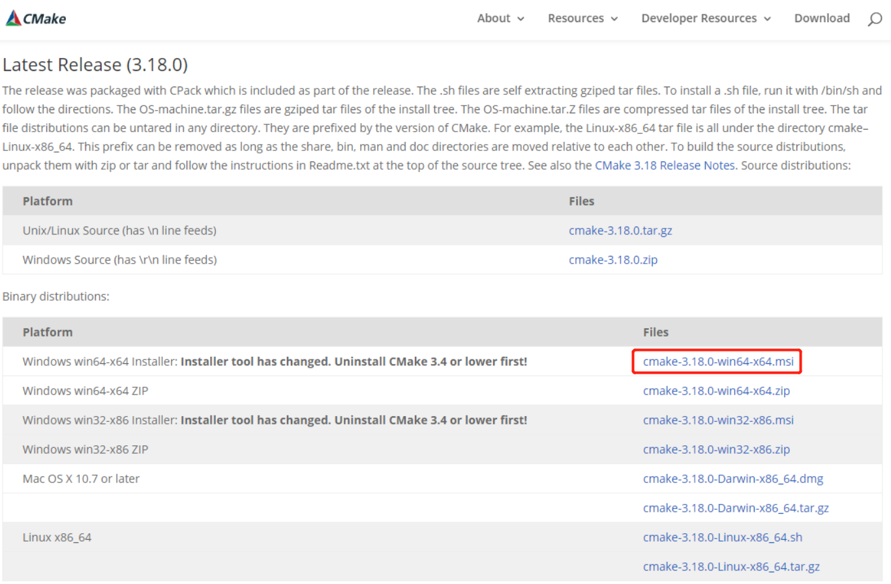
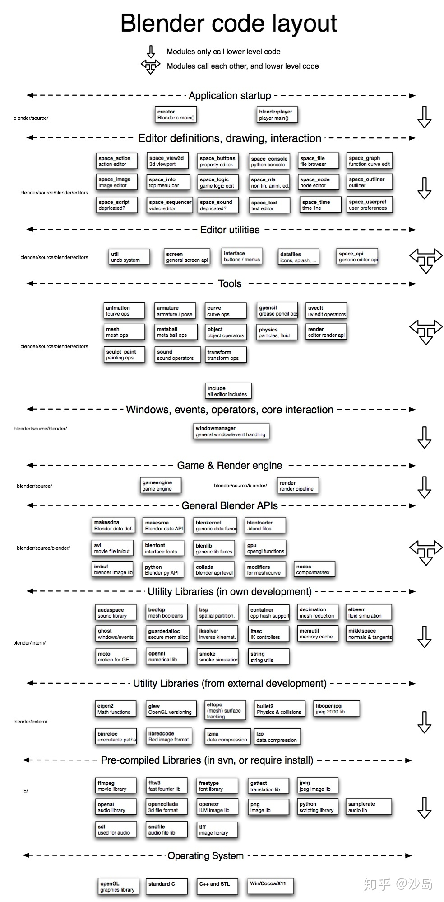
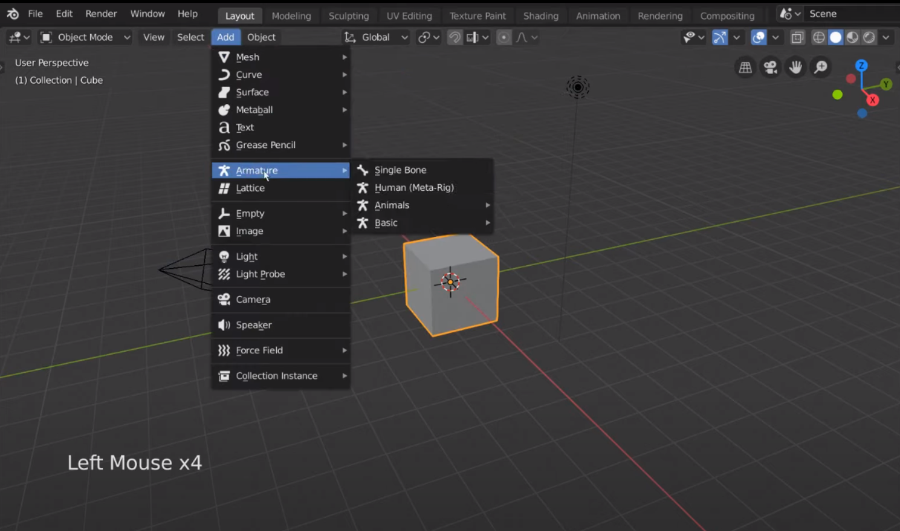

# Blender

安装版本：2.83 LTS

软件下载：https://www.blender.org/download/

官方教程：https://www.blender.org/support/tutorials/

官方手册：https://docs.blender.org/manual/en/latest/

（如需要指定版本，例如：https://docs.blender.org/manual/en/2.80/）

Wiki：https://wiki.blender.org/wiki/Main_Page

- Code Documentation：https://wiki.blender.org/wiki/Source
  - 源码目录结构：https://wiki.blender.org/wiki/Source/File_Structure

源码压缩包：https://download.blender.org/source/

源码Github：https://github.com/blender/blender

2.81的改进之一是使用optix来加速cycles（是blender离线渲染引擎的名字）光线追踪。我们熟知的有windows平台上的dxr管线。而optix使得其他操作系统（如linux）也能使用n卡的光线追踪硬件。至此2.81中cycles支持的渲染方式有cpu、gpu通用计算管线cuda、opencl、optix。

## Building

### CMake下载安装

参考链接：https://blog.csdn.net/qq_41895190/java/article/details/89299988

CMake是一个比make更高级的编译配置工具，它可以根据不同平台、不同的编译器，生成相应的Makefile或者vcproj项目。通过编写CMakeLists.txt，可以控制生成的Makefile，从而控制编译过程。CMake自动生成的Makefile不仅可以通过make命令构建项目生成目标文件，还支持安装（make install）、测试安装的程序是否能正确执行（make test，或者ctest）、生成当前平台的安装包（make package）、生成源码包（make package_source）、产生Dashboard显示数据并上传等高级功能，只要在CMakeLists.txt中简单配置，就可以完成很多复杂的功能，包括写测试用例。如果有嵌套目录，子目录下可以有自己的CMakeLists.txt。

**官网：**https://cmake.org/download/

建议下载msi文件然后点击安装（可以自定义安装路径，需要注意选择添加环境变量选项）



**使用CMake：**

- 打开CMake的GUI界面，输入source code位置、build结果目录
- 点击Configure，点击Generate生成Makefile
- build目录下打开命令行输入make进行编译
- 完成后在build目录生成exe文件即可运行
- make install和make test的用处还没明白


### 编译步骤

**参考链接：**

[官方说明 Building Blender on Window](https://wiki.blender.org/wiki/Building_Blender/Windows)

[blender源码编译——（win10，VS2015环境）](https://blog.csdn.net/code_better/article/details/53434919)

[Blender源代码编译（VS2019、win64_vc15）](https://blog.csdn.net/lww_email/article/details/106940183)

- 安装依赖：

  - 需要提前安装SVN、Git、CMake、Visual Studio（install  'Desktop Development with C++' workload）

  - 我这边的配置是TortoiseSVN，CMake 3.18，Visual Studio 2017

  - 【注意】VS2017和VS2019都支持，可以在官方说明文档下面Advanced Setup——Development Tools——Visual Studio看到

- 创建根目录存储代码，例如`E:\Blender-2.83-build`

- 下载Blender源码：

  - 方法1：（官网给的方式）在根目录下打开cmd命令行，执行`git clone git://git.blender.org/blender.git`，速度好慢

  - 方法2：下载https://download.blender.org/source/中最下面的`blender-2.83.2.tar.xz`，解压并重命名，形成`.\blender`目录

  - 方法3：下载https://github.com/blender/blender仓库压缩包，解压并重命名，形成`.\blender`目录

  - 【注意】方法2和3的后续会遇到报错，说not a git repository、Failed to get Blender git branch，最后某个早上方法1下载成功了

- 下载Blender libraries：
  - 方法1：（官网给的方式）在`.\blender`目录下，运行`make update`
  - 方法2：创建`.\lib\win64_vc15`目录，SVN Checkout这个链接https://svn.blender.org/svnroot/bf-blender/trunk/lib/win64_vc15，不同版本给出的链接可能最后数字会有些不同，具体请参考官网说明的最下面——Advanced Setup——Download Sources and Libraries。
  - 【注意】速度都好慢啊，如果中途报错`svn: E120106: ra_serf: The server sent a truncated HTTP response body`，可以一次运行`svn cleanup`和`svn up`，再次尝试下载。我最后是拿了别人以前下载好的`win64_vc15`，然后在`.\blender`目录下进行`make update`来更新

- 编译 Blender：

  - 在`E:\Blender-2.83-source\blender`目录下，运行`make`（据说和`.\blender\make.dat`这个文件作用一样？）
- 运行Blender：

  - 可以在`.\build_windows_x64_vc15_Release\bin\Release`下面找到`blender.exe`文件，双击运行
  - 如果弹出提示说图形显卡需要更新，可以在左下角Win按钮旁边点击查找，输入GeForce，进入Geforce Experence，选择顶部栏“驱动程序”，下载最新的Geforce Game Ready Driver


## 源码结构


blender的编译需要两个部分

- 一个部分是由svn来版本控制的预编译lib，在下图为pre-compiled libraries部分，路径和blender文件夹同级，为lib/

- 另外一个部分是由git来版本控制的源码，其中有三种：分为intern、extern和source，这也能从图片左侧的路径看得出
  - intern是blender开发的较为底层的一些源码，路径为blender/intern
  - extern是非blender开发（如物理引擎bullet）的源码，路径为blender/extern
  - source是较为上层的源码，路径为blender/source



### 目录说明


### Play

介绍Lniux下的编译，以及如何更改登录显示界面所用的图片

https://www.youtube.com/watch?v=opl4Y7DfxR4

## 界面操作

快捷键：https://zhuanlan.zhihu.com/p/126650481

## 骨骼

- 源码关键词：armature, pose

- 位置：`.\blender\source\blender\editors\armature`



## 蒙皮

- 源码关键词：paint, sculpt
- 位置：`.\blender\source\blender\editors\sculpt_paint`

## 其他

#### mesh源码

位置：`.\blender\source\blender\bmesh`

文件名：`bmesh_class.h`

bmesh模块中的所有类声明，包括了构建一个mesh的所有要素，把数据组织起来。

http://tombraiderjf.com/articles/blender-note.html

```C++
/**
 * BMHeader
 *
 * All mesh elements begin with a BMHeader. This structure
 * hold several types of data
 *
 * 1: The type of the element (vert, edge, loop or face)
 * 2: Persistent "header" flags/markings (smooth, seam, select, hidden, etc)
 *     note that this is different from the "tool" flags.
 * 3: Unique ID in the bmesh.
 * 4: some elements for internal record keeping.
 */
typedef struct BMHeader {
  /** Customdata layers. */
  void *data;
```


#### Blender 源码学习 --- Modifier

https://cjld.github.io/2014/08/16/blendccodemodifier/

#### Blender 源码学习--Operator 转

https://my.oschina.net/u/2306127/blog/372662


