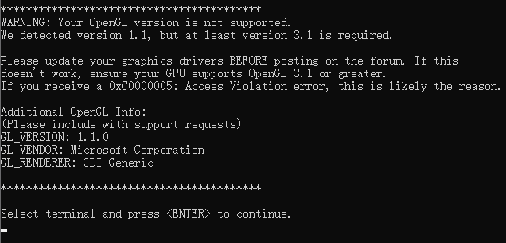
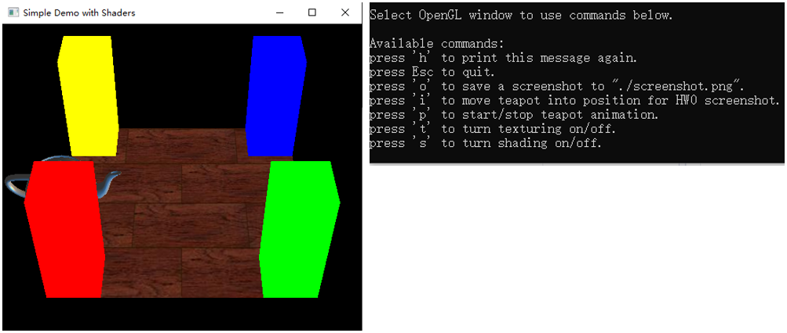
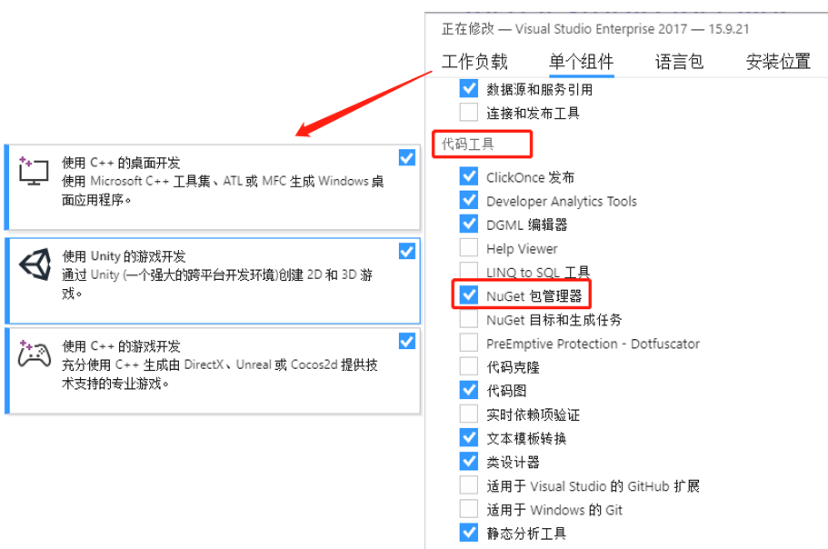
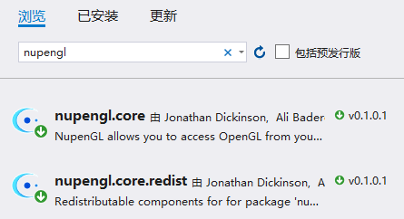
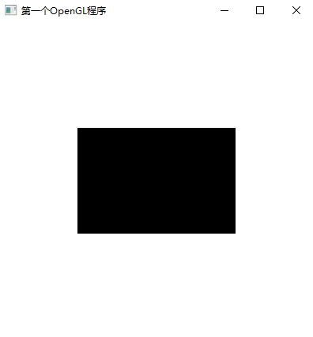
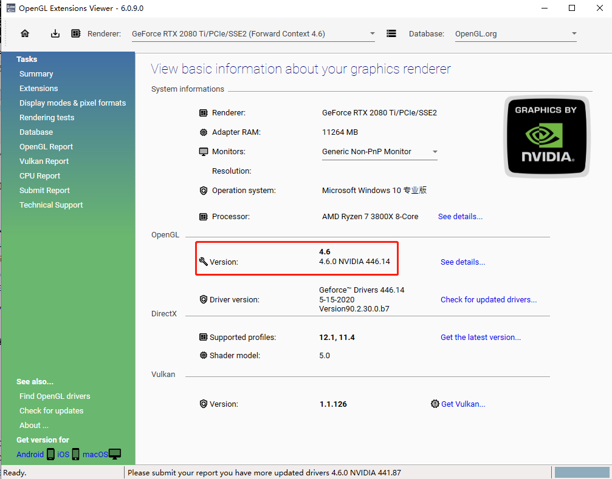

## Computer Graphics 

需要补充OpenGL、GLSL背景知识，会用到它们写代码

需要补充raytracing背景知识

**Reference: ** 

 a reference for OpenGL and the GL shading language (GLSL) are useful

The standard red book for OpenGL, and the orange book for the GL shading language. 

### 概述

**3D Graphics Pipeline:**

Modeling - Animation - Rendering (light & shadow & shading)

**About homework:**

HW1: transformations

HW2: Scene Viewer (GLSL, rasterize)

HW3: Ray Tracer

**Rasterization** essentially goes through all the geometric primitives and dertermines where in the screen they should go.

**Raytracing** does the opposite thing which goes to each point or each pixel in the screen and determines which geometric primitive that corresponds to.

**发展历程介绍**

Rendering: 1970s (lighting)

- Diffuse Lighting (Gouraud 1971)
  

Gouraud shading / smooth shading

让阴影更加平滑（still used in OpenGL）

- Specular Lighting (Phong 1974) 

  Phong shading / Phong illumination

  让物体显得有光泽 （still used in 99% of computer generated imagery）

- Curved Surfaces, Texture (Blinn 1974)

- Z-Buffer Hidden Surface (Catmull 1974)

Rendering: 1980s, 90s (Global Illumination)

- recursive ray-tracing algorithm (Whitted 1980)

- radiosity (Goral, Torrance et al/ 1984)

  举例：Cornell Box，盒子的颜色都是由墙面反射得到的

- rendering equation (Kajiya 1986)

**History of Computer Animation**

https://www.youtube.com/watch?v=LzZwiLUVaKg

https://www.youtube.com/watch?v=S3hqS6JlKEc

### HW 0: COMPILATION

The Homework 0 program has a textured ground plane with 4 "pillars" and a teapot with lighting that moves.

- 下载windows版的作业，解压到本地文件夹：http://cseweb.ucsd.edu/~viscomp/classes/cse167/wi17/assignments/Windows/hw0-windows.zip

- 通过visual studio 2017打开hw0-windows.sln文件，按F5

  

- 发现OpenGL版本过低，需要按照下面的步骤升级一下OpenGL

- 升级后F5正常运行，显示出对应场景，并给出提示

  

- 鼠标点击界面拖拽可以实现zoom in / out

  p可以播放或者暂停动画（会循环播放）

  i会将视角和茶壶位置调整到规范状态

  o会创建屏幕快照并保存

  退出方式：ESC

Note for this program, the *shader* directories that contain glsl shaders. These are files that are loaded and compiled by the OpenGL program at runtime and therefore must exist, but need not be part of the Makefile or project.


#### Visual Studio下安装OpenGL (是否有必要？)

参考链接：https://www.cnblogs.com/flylinmu/p/7823019.html

打开Visual Studio Installer，检查“工作负载”和“单个组件”中是否勾选齐全



下载[GLUT库](https://www.opengl.org/resources/libraries/glut/glutdlls37beta.zip)，解压文件，然后进入Visual Studio目录：`E:\Microsoft Visual Studio\2017\Enterprise`

- 把`glut.h`放到`.\VC\Tools\MSVC\14.10.25017\include\gl`下（没有gl文件夹就新建一个）
-  把`glut.lib`和`glut32.lib`放到`.\VC\Tools\MSVC\14.10.25017\lib\x86`下

- 把`glut.dll`和`glut32.dll`放到`C:\Windows\SysWOW64`下（我的系统是64位的，如果是32位的系统，请放到`C:\Windows\System32`下）

接下来打开VS2017，新建一个C++空项目，选择菜单栏“项目”，点击“管理NuGet程序包”，点击浏览， 搜索“nupengl”，安装nupengl.core。【**注意：每次新建项目都要安装一下，NuGet帮助我们管理Package**】



然后新建源文件.cpp，试运行一下代码

```c++
#include<gl/GLUT.H>
void Initial(void)//初始化函数 
{
	glClearColor(1.0f, 1.0f, 1.0f, 1.0f);//白色背景，前3个是RGB，最后是Alpha值，用来控制透明，1.0表示完全不透明
	glMatrixMode(GL_PROJECTION);//OpenGL按照三维方式来处理图像，所以需要一个投影变换将三维图形投影到显示器的二维空间中
	gluOrtho2D(0.0, 200, 0.0, 150.0);//指定使用正投影将一个x坐标在0~200，y坐标0~150范围内的矩形坐标区域投影到显示器窗口

}
void myDisplay(void)//显示回调函数
{
	glClear(GL_COLOR_BUFFER_BIT);//使用glClearColorz中指定的值设定颜色缓存区的值，即将窗口中的每一个像素设置为背景色
	glColor3f(0.0f, 0.0f, 0.0f);//绘图颜色为黑色
	glRectf(50.0f, 100.0f, 150.0f, 50.0f);//图形的坐标，绘制一个左上角在（50，100），右下角在（150，50）的矩形
	glFlush();//清空OpenGL命令缓冲区，强制执行命令缓冲区中所有OpenGL函数
}
int main(int argc, char * argv[])//这是使用glut库函数进行窗口管理
{
	glutInit(&argc, argv);//使用glut库需要进行初始化
	glutInitDisplayMode(GLUT_RGB | GLUT_SINGLE);//设定窗口显示模式，颜色模型和缓存，这里是RGB颜色模型和单缓存
	glutInitWindowPosition(100, 100);//设定窗口的初始位置，屏幕左上角为原点，单位为像素
	glutInitWindowSize(400, 400);//设定窗口的大小
	glutCreateWindow("第一个OpenGL程序");//创建一个窗口，参数是窗口标题名
	glutDisplayFunc(&myDisplay);//将myDisplay指定为当前窗口的显示内容函数
	Initial();
	glutMainLoop();//使窗口框架运行起来，使显示回调函数开始工作
	return 0;
}
```

显示黑色矩形，即代表成功：



#### 更新显卡驱动

鲁大师——驱动检测——更新显卡驱动

可以通过下载OpenGL Extensions Viewer来查看OpenGL版本

更新前后，OpenGL由1.1变为4.6




###  OpenGL介绍


