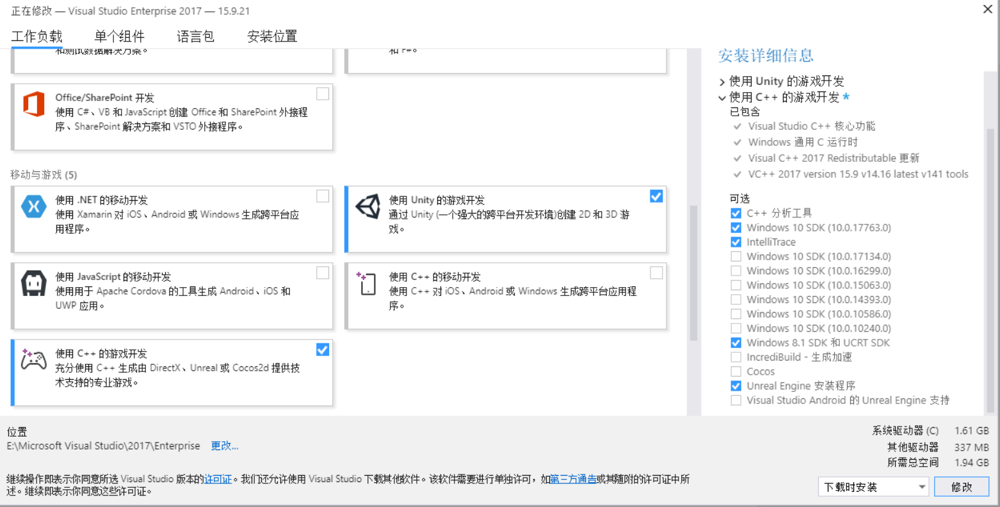
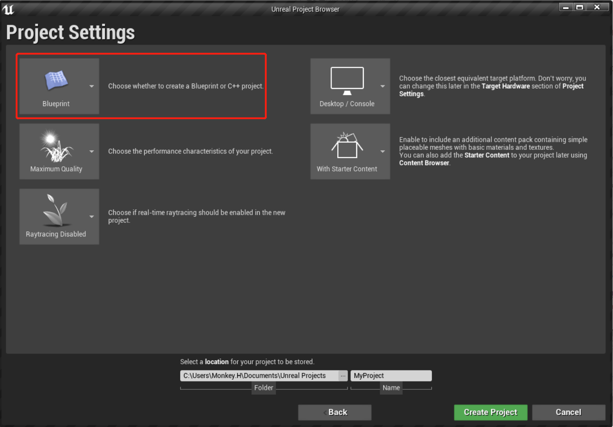
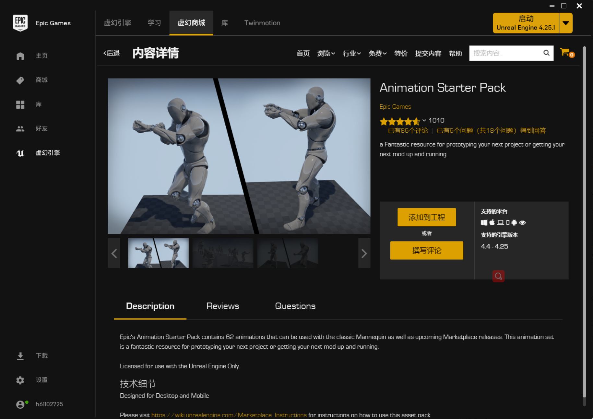
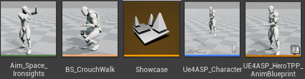
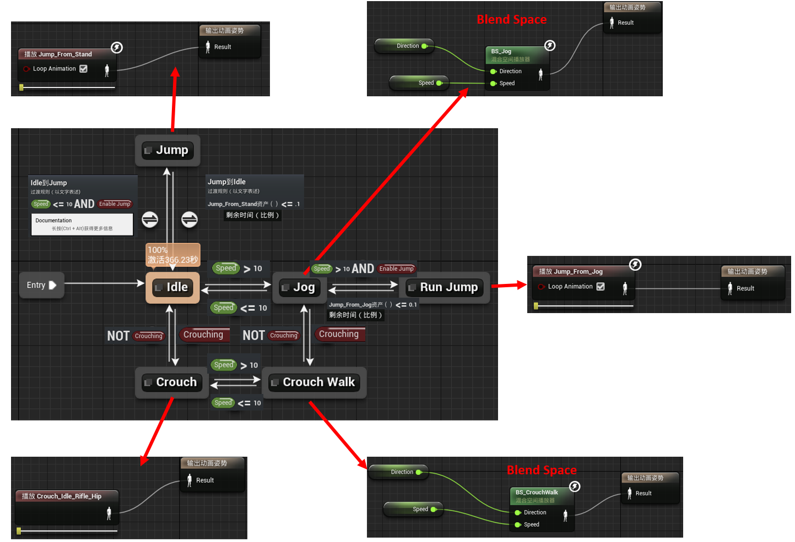
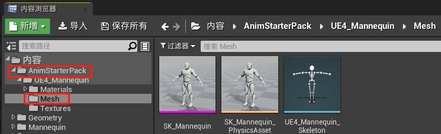
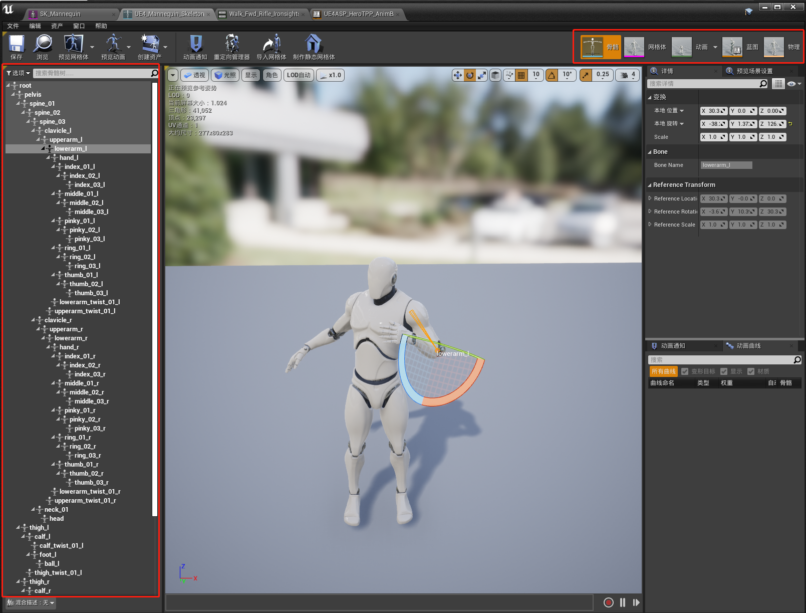
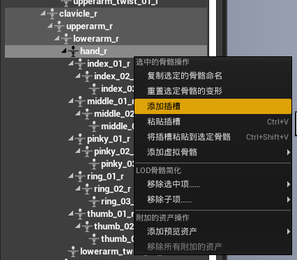

# Unreal Engine

## 入门配置

**设置虚幻引擎的Visual Studio：**

https://docs.unrealengine.com/zh-CN/Programming/Development/VisualStudioSetup/index.html

https://www.bilibili.com/video/BV1Gt411u7rk/?spm_id_from=trigger_reload

要勾选“使用C++的游戏开发”还要额外勾选右侧的"Unreal Engine安装程序"

增加解决方案配置下拉菜单的宽度、添加解决方案平台下拉菜单（默认已经勾选上了）

**创建项目**

选择BluePrint模式耗显卡，对CPU需求弱一些；选择C++模式对CPU要求高，显卡要求低。

With Starter Content之后熟练了可以不勾选，会多600M左右大小的相关文件。如果后续需要也可以复制粘贴过来到相应目录。

## 动画系统

### 入门操作

**Animation Starter Pack**

从虚幻商城中购买免费素材Animation Starter Pack，添加进工程。

内容浏览器中即出现Animation Starter Pack文件夹，包含多个Animation Sequence（绿色条）、Blend Space（浅粉色）、AnimBluePrint（橙色）、Character（蓝色）

打开给出的动画蓝图，这里我注明了各个状态节点的内部情况和过渡条件

内容浏览器中Animation Starter Pack文件夹下也给出了Skeleton Mesh（骨骼网格体），Skeleton Mesh与普通Mesh的区别在于它里面包含Skeleton所以可以移动。

Skeleton点开可以看到整个骨架树，可以点选每个关节。右上角按钮可以快速切换到各个资源。

### Socket

Socket（插槽）：附在关节上随着关节一起移动，用于角色手持武器等场景

右键单击想要添加socket的关节，选择“添加插槽”，即可得到一个“hand_r插槽”作为“hand_r”的子关节，显示在骨架树里。

Using Sockets https://www.bilibili.com/video/BV1AE411h7V6?p=5

Attaching To Sockets https://www.bilibili.com/video/BV1AE411h7V6?p=6

### Blend Space

BlendSpace Introduction https://www.bilibili.com/video/BV1AE411h7V6?p=8

Using a 2D BlendSpace https://www.bilibili.com/video/BV1AE411h7V6?p=9

### Blue Prints

Animation Blueprints https://www.bilibili.com/video/BV1AE411h7V6?p=10

Animation States https://www.bilibili.com/video/BV1AE411h7V6?p=11

Animation Event Graph https://www.bilibili.com/video/BV1AE411h7V6?p=12

Transitional Rules https://www.bilibili.com/video/BV1AE411h7V6?p=13

### 动画遮罩

Merging Animation https://www.bilibili.com/video/BV1AE411h7V6?p=14

